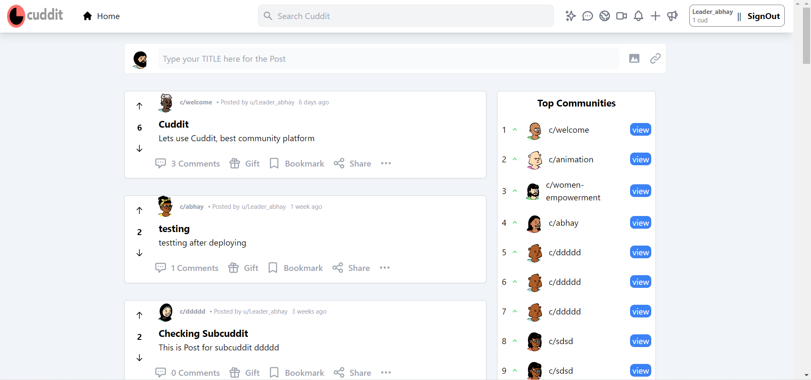
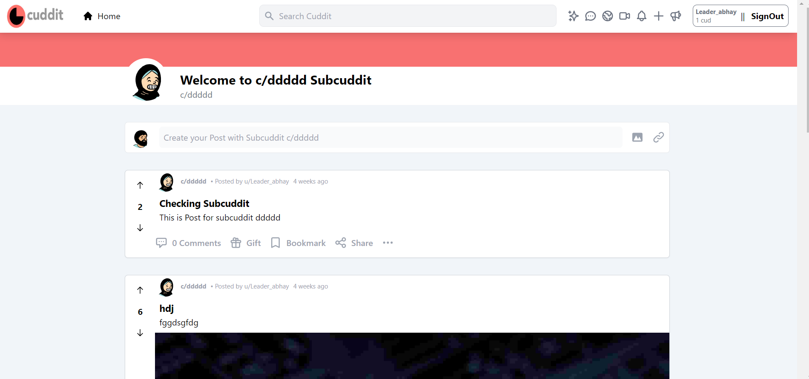

<div id="top"></div>
<!-- PROJECT LOGO -->
<br />
<div align="center">
  <a href="https://cuddit.vercel.app/" target="_blank">
    
  </a>

  <h2 align="center">Cuddit</h2>

  <p align="center">
    Cuddit is a social news website and forum where content is socially curated and promoted by site members through voting.
    <br />
    <p>**Project submission for the Hackathon <a href = "https://stepzen.devpost.com/" target="_blank">Stepzen GraphQL Challange</a>**</p>
    <br />
    <a href="https://github.com/MitAbhay/Cuddit/issues target="_blank">Report Bug</a>
    ·
    <a href="https://github.com/MitAbhay/Cuddit/issues target="_blank">Request Feature</a>
  </p>
</div>
<!-- ABOUT THE PROJECT -->

# About The Project

<div align="center">


</div>
    <br />

This is Social Website like reddit, which I named as Cuddit. It is totally functionable application, where user can login with the help of its official reddit acccount, user can post the content with its own username i.e similar to its reddit username, user can create the subcuddit similarly we create subreddit in reddit, there are different pages for subcuddit pages, user can post according to its intrested subcuddit on its page, any one us (who is logged in) can comment and vote to users post.

I have used various new technolgies to make application best for the user. I have built the best user-friendly interface, so that users can understand the application and can navigate more easily.

# What Tech Stack I have Used and Why?

- NextJs : I have created the Frontend part this website using NextJs Framework, and realy its the best Frontend Framework I have ever used. I have used powerfull Features of the NextJs which makes the development really worthfull.

- TypeScript : I have used Typescript in this Application, because it makes the js develepment easier for us when we are dealing with large codes. It helps us to maintain the type of each and every thing easily.

- Stepzen : I have used graphql with the help of stepzen, it is really an amazing technology, it simplify how we access the data we need, and with zero infrastructure to build or manage, we can focus on crafting modern data-driven experiences.

<p align="right">(<a href="#top">back to top</a>)</p>

<!-- CONTRIBUTING -->

<!-- # CONTRIBUTION TO THIS PROJECT -->

# Run this project in your system

<!--
You can also Contribute to this project to make it more better and user friendly. -->

## Prerequisites

You need NodeJs installed in your system to run this project

- To check
  ```sh
  node -v
  ```

## Installation

Follow the following points to run this in your system

1.  Fork the repo
2.  Clone the repo
    ```sh
    git clone https://github.com/your_username_/Project-Name.git
    ```
3.  Enter in the project directory
    ```sh
    cd Project-Name
    ```
4.  Run it
    ```sh
    npm run dev
    ```

<!-- ## Cuntribution Steps

Contributions are what make the open source community such an amazing place to learn, inspire, and create. Any contributions you make are **greatly appreciated**.
If you have a suggestion that would make this better, please fork the repo and create a pull request. You can also simply open an issue with the tag "enhancement".
Don't forget to give the project a star! Thanks again!

1. Fork the Project
2. Create your Feature Branch (`git checkout -b feature/AmazingFeature`)
3. Commit your Changes (`git commit -m 'Add some AmazingFeature'`)
4. Push to the Branch (`git push origin feature/AmazingFeature`)
5. Open a Pull Request -->

<!-- CONTACT -->

# Contact Me

- Abhay Kumar Mittal - [LinkedIn](https://www.linkedin.com/in/mitabhay/)
